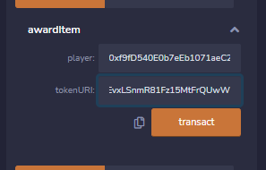

# Use Remix IDE

### 1. [Connect wallet to Worldland network](broken-reference)

### 1.1 ❗️ Fund your WorldLand

When deploying contracts, you need some coins. This a way how to get world land testnet coins! Plz follow these [statements](https://ethworldland.gitbook.io/ethereum-worldland/use/how-to-obtain-your-wlcs-the-worldland-coins):


### 2. Run the remix and compile the code

Remix-IDE: https://remix-project.org/

2.1 make file and input file name&#x20;

any name is okay

<div align="center" data-full-width="false">

<figure><figcaption></figcaption></figure>

</div>

2.2 write or Paste contract code&#x20;

I use this code samples

2.2.1 fungible tokens

```
// contracts/ testerc20.sol
// SPDX-License-Identifier: MIT
pragma solidity ^0.8.0;
import "@openzeppelin/contracts/token/ERC20/ERC20.sol";

contract TESTToken is ERC20 {
    constructor(uint256 initialSupply) ERC20("TEST", "TST") {
        _mint(msg.sender, initialSupply);
    }
}
```

2.2.2 Non-fungible tokens

```
// contracts/testerc721.sol
// SPDX-License-Identifier: MIT
pragma solidity ^0.8.0;
import "@openzeppelin/contracts/token/ERC721/ERC721.sol";
import "@openzeppelin/contracts/token/ERC721/extensions/ERC721URIStorage.sol";
import "@openzeppelin/contracts/utils/Counters.sol";

contract TESTItem is ERC721URIStorage {
    using Counters for Counters.Counter;
    Counters.Counter private _tokenIds;
    
    constructor() ERC721("TESTItem", "TST") {}
    
    function awardItem(address player, string memory tokenURI)
        public
        returns (uint256)
    {
        _tokenIds.increment();
        uint256 newItemId = _tokenIds.current();
        _mint(player, newItemId);
        _setTokenURI(newItemId, tokenURI);
        return newItemId;
    }
}
```

When you're done writing the code, go to the Compile tab.

<mark style="color:red;">**Warning!**</mark> Set the **EVM** version to <mark style="color:red;">**Paris**</mark> and compile.

Once you've changed the version, press the **Compile button** to run the **compile**.

<div align="center">

<figure><figcaption></figcaption></figure>

 

<figure><figcaption></figcaption></figure>

</div>

### 3. Connect to Metamask and deploy to contract

After compiling, go to the Deployment tab.

Select "injected web3" in the environment.

The connected network number and account will then appear.

<div>

<figure><figcaption></figcaption></figure>

 

<figure><figcaption></figcaption></figure>

</div>

If there are parameters of the contract constructor, write them by clicking the button in the picture below.

<div>

<figure><figcaption></figcaption></figure>

 

<figure><figcaption></figcaption></figure>

</div>

Click the TRANSACT button to deploy the contract.&#x20;

Finally, you can deploy contract to ETH-ECC

<figure><figcaption></figcaption></figure>

### 4. Execute function of contract

You can excute function of contract in Deployed Contracts

<div>

<figure><figcaption></figcaption></figure>

 

<figure><figcaption></figcaption></figure>

</div>

### 5. Import token in metamask

You can check your tokens in metamsk using "Import tokens"

<div>

<figure><figcaption></figcaption></figure>

 

<figure><figcaption></figcaption></figure>

</div>

<div>

<figure><figcaption></figcaption></figure>

 

<figure><figcaption></figcaption></figure>

</div>


### Extra. Save nft using ipfs(pinata)

&#x20;Below is how to register NFT using pinata and ipfs in erc721.&#x20;

If the above TEST721.sol contract is deployed, the following functions appear.

<div>

<figure><figcaption></figcaption></figure>

 

<figure><figcaption></figcaption></figure>

</div>

awarditem is a function that awards the NFT json file in tokenUrl to the player.

So, we need to store the JSON file in the URL.&#x20;

Upload the NFS JSON file to IPFS using pinata.

1. First sign up for Pinata



<figure><figcaption></figcaption></figure>

2\. upload image of nft and make json The format of the json file is as follows.

```
{
"name": "timetable",
"description": "smin's timetable",
"image":
"https://gateway.pinata.cloud/ipfs/QmWnNt8jdSxVX981abPHKTAsg5E31u2Zh8AfsVqzhyGzSk",
"strength": 20
}
```

If you want to include an image, the image must also be stored in ipfs. So, I upload the image first.

<figure><figcaption></figcaption></figure>


You can see the file is saved.&#x20;

Click the eye icon and copy the url of the image.&#x20;

<figure><figcaption></figcaption></figure>

image ipfs example: [https://gateway.pinata.cloud/ipfs/QmWUR3PYmorqqQ2mGwQAr3ujUNnpANS2xyKJYBxegwFeS8](https://gateway.pinata.cloud/ipfs/QmWUR3PYmorqqQ2mGwQAr3ujUNnpANS2xyKJYBxegwFeS8)


Paste the url into the image item in json.&#x20;

"image": "[https://gateway.pinata.cloud/ipfs/QmWnNt8jdSxVX981abPHKTAsg5E31u2Zh8AfsVqzhyGzSk](https://gateway.pinata.cloud/ipfs/QmWnNt8jdSxVX981abPHKTAsg5E31u2Zh8AfsVqzhyGzSk)",

3\. Upload the json to pinata and copy the url. The method is the same as the image.

json ipfs example:

[https://gateway.pinata.cloud/ipfs/QmcpjQMRyBQ8qBZcVidyeD67EvxLSnmR81Fz15MtFrQUwW](https://gateway.pinata.cloud/ipfs/QmcpjQMRyBQ8qBZcVidyeD67EvxLSnmR81Fz15MtFrQUwW)

<figure><figcaption></figcaption></figure>

Finally, copy the address of your wallet, put your wallet address in the player, and the json url in tokenURL and send the transaction.

<div>

<figure><figcaption></figcaption></figure>

 

<figure><figcaption></figcaption></figure>

</div>

<div>

<figure><figcaption></figcaption></figure>

 

<figure><figcaption></figcaption></figure>

</div>

You saved the NFT!&#x20;


