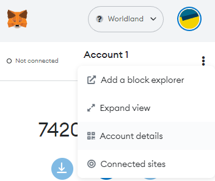
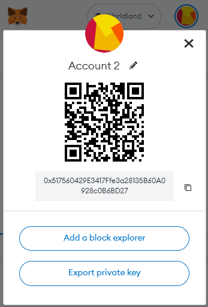
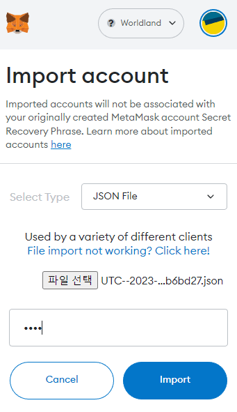

# Check Balance

## **Check mined block in explorer**


See the [**Block Explorer**](../../user/user/block-explorer.md) tab for more information about explorers.


You can check the contents of the **mined block** in the **block explorer**.

Search the **mined block number** in the explorer.

<figure><figcaption></figcaption></figure>

You can also search by **wallet address**.

<figure><figcaption></figcaption></figure>

## Import ETH-ECC wallet account to Metamask

This part explains how to link your **Metamask** account to the **ETH-ECC** console and your Eth-ECC account to Metamask.



**Metamask** must be installed and connected to the **Worldland** network for this to work.



Please refer to the [**Wallet** ](../../user/user/wallet.md)and [**Network** ](../../user/user/network.md)section for information on installing and connecting Metamask.&#x20;


### Metamask account  to Eth-ECC

You can find **Account details** in the menu to the right of your **Metamask account**.

<figure><figcaption></figcaption></figure>

Press the **export private key** button and enter the **password** to obtain the **private key.**

<figure><figcaption></figcaption></figure>

Enter the obtained **private key** and **password** into the **ETH-ECC** console.

**`web3.personal.importRawKey("PRIVATE_KEY", "METAMASK_PASSWORD"`**`)`

```
> eth.accounts
["0xb8c941069cc2b71b1a00db15e6e00a200d387039"]
```

then can you check account :)

### ETH-ECC account to metamask

Generating new account:

```
> personal.newAccount("YOUR_PASSWORD")
```

returns data that looks like:

```
INFO [08-06|21:33:36.241] Your new key was generated               address=0xb8C941069cC2B71B1a00dB15E6E00A200d387039
WARN [08-06|21:33:36.241] Please backup your key file!             path=/home/hskim/Documents/geth-test/keystore/UTC--2019-08-06T12-33-34.442823142Z--b8c941069cc2b71b1a00db15e6e00a200d387039
WARN [08-06|21:33:36.241] Please remember your password! 
"0xb8c941069cc2b71b1a00db15e6e00a200d387039"
```

We generated the address :**`0xb8C941069cC2B71B1a00dB15E6E00A200d387039`**. You can check the account using the following command.

```
> eth.accounts
["0xb8c941069cc2b71b1a00db15e6e00a200d387039"]
```


You can find your key file in  **`YOUR_DATADIR/keystore`**

If not configured, the data storage location is **`~/.ethereum.`**


For Windows, the location is

&#x20;C:\Users\\_**\[Username]**_\AppData\Local\Ethereum\\_**\[seoul/gwangju]**_\keystore


<figure><figcaption></figcaption></figure>

Open metamask, select the network and then select "**Import Account**"

<figure><figcaption></figcaption></figure>

Select **JSON File** from **Select Type** and import the file. And enter the **password** you entered when creating your account.

<figure><figcaption></figcaption></figure>


This process may take **5 minutes** :)



Then, you can import an account to **Metamask!**


