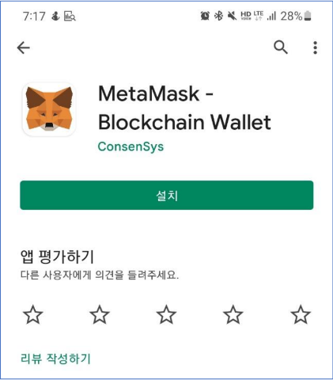

# Deploy a Non-Fungible Token contract

Sadly, the confirmation of the nft you have is only possible in the metamask app, not in the metamask extension.

Below is how to check nft through the metamask app. Contents related to smart contract deployment have been omitted.

### 1. Download MetaMask app in store

<figure><figcaption></figcaption></figure>

### 2. Get account with account seed phrase&#x20;

(there is no image because capture is blocked.) However, it is the same as an extension.

\[image2]

\[image3]

### 3. Set Network

You can import a wallet using your private key (same as extension)

NETWORK NAME: ETH-ECC

RPC URL: https://rpc.lvscan.io/

CHAIN ID: 12345

\[image4]

### 4. Import NFT

Then enter the contract address and token ID(may be 1).

\[image5]

You can see your nft contract and nft.

\[image6]
