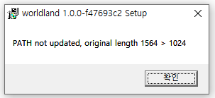

# How to connect wallet

> _Metamask is a universal cryptocurrency wallet compatible with Ethereum-based chains. Metamask is an extension that works as a plugin for Chrome-based web browsers._

_We use the Chrome browser as an example. Please refer_ [_here_](https://www.google.com/chrome) _to download the Chrome browser._

## 1. Install MetaMask

Go to the Chrome Web Store, search for the [MetaMask](https://chrome.google.com/webstore/detail/metamask/nkbihfbeogaeaoehlefnkodbefgpgknn) extension and add it.

<figure><figcaption></figcaption></figure>

After installation, click the puzzle-shaped expansion icon on the top right corner to find MetaMask.

<figure><figcaption></figcaption></figure>

## 2.  Run MetaMask

Click the Create Wallet button and enter your password.

A 12-word phrase appears. Only this phrase can recover your wallet, so be careful not to expose it.

<figure><figcaption></figcaption></figure>

When the wallet creation is complete, you can see the wallet screen as shown below.

<figure><figcaption></figcaption></figure>

## 3.  Connect to Worldland
