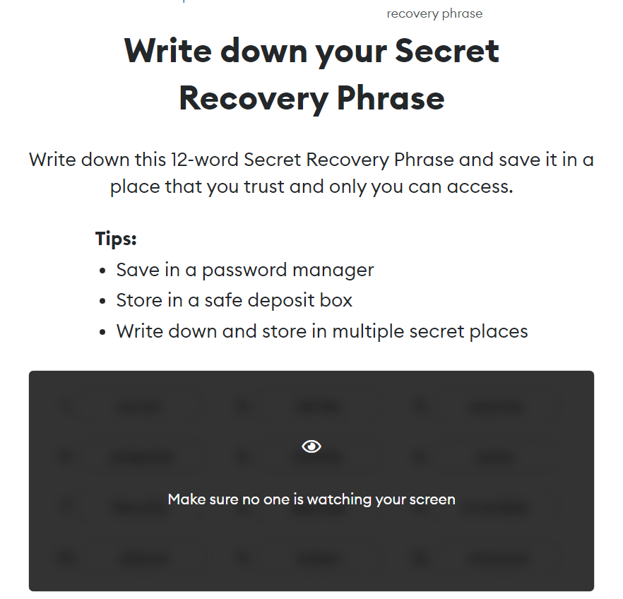

# How to send and receive coins.

Sending coins is really simple.

### Prerequisites

1. Connected WorldLand Network
2. Small amount of WLC

Just follow the picture.

1. Click the red box

<figure><figcaption></figcaption></figure>

2. Write the receiving address in the red box

.png>)

3. Write the amount of WLC you want to send

.png>)

4. Just click the Next button and you're done

