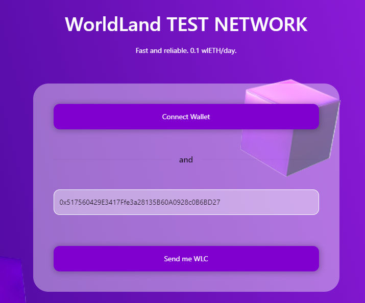
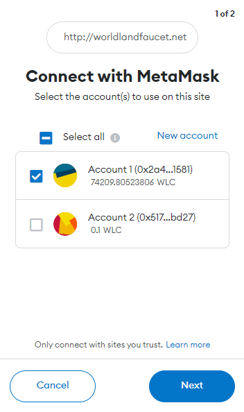

# Get WLCs

You can get a WLC for testing from the site below.

* [https://gwangjufaucet.org](https://gwangjufaucet.org)


You can only receive 0.1 WLC once per day.


<figure><figcaption></figcaption></figure>

To connect to your wallet, simply click on the Connect button.

<figure><figcaption></figcaption></figure>

After pressing the "**Send me WLC**" button, you will receive your WLC in a minute or two.

<figure><figcaption></figcaption></figure>
