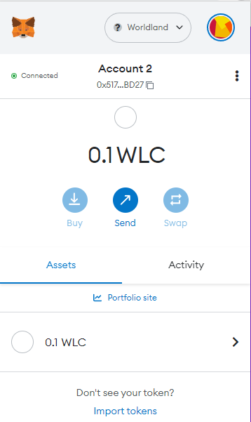

# How to obtain your WLCs the WorldLand coins

You can get a WLC for testing from the site below.



<figure><figcaption></figcaption></figure>

To connect to your wallet, simply click on the Connect button.

<figure><figcaption></figcaption></figure>

After pressing "**Send me WLC**" button, you will receive your WLC in a minute or two.

<figure><figcaption></figcaption></figure>
