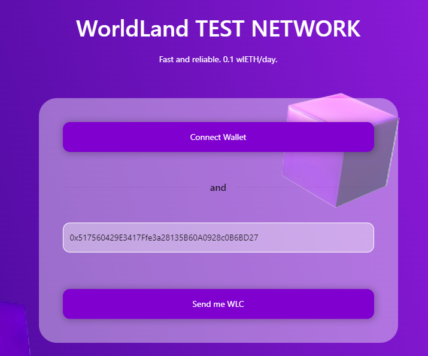
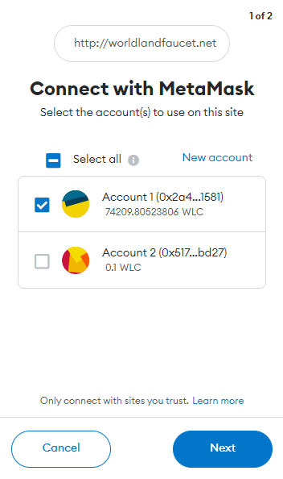
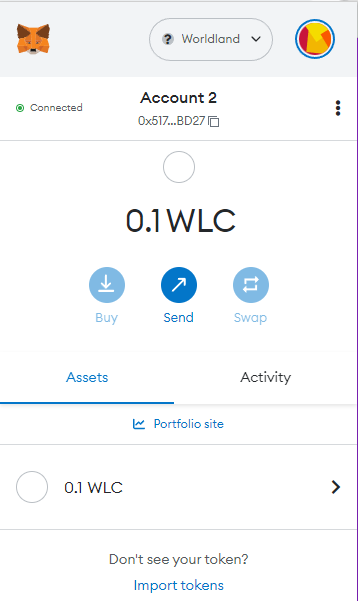

# Get WLCs

You can get a **WorldLand Coin(WLC)** for testing from the site below.

* [https://gwangjufaucet.org](https://gwangjufaucet.org)

<figure><figcaption></figcaption></figure>


Note: You can only receive **0.1 WLC** once per day.


To connect to your wallet, simply click on the **Connect** button.

<figure><figcaption></figcaption></figure>

After pressing the "**Send me WLC**" button, you will receive your **WLC** in a minute or two. You can check the status by looking for a transaction to your address on [**Block Explorer**](http://scan.worldland.foundation/).

<figure><figcaption></figcaption></figure>
